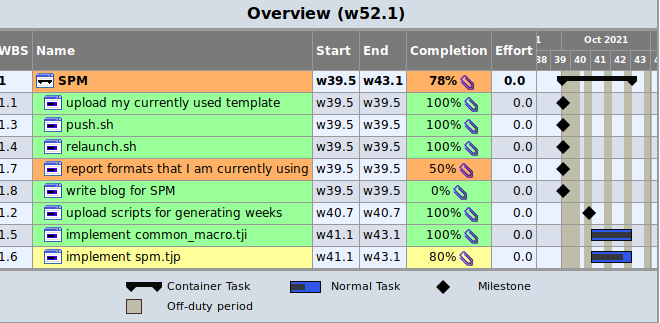

# SPM
A Smart plain text Project Management tool based on TaskJuggler and Python

# How to build project?

For example: 

	tj3 spm.tjp

# How to launch a web server?

tj3d -c ./.taskjugglerrc -p 8474  --webserver --debug

# How to show status of projects

tj3client status

# How to add a project

tj3client add spm.tjp

# How to remove a project

tj3client remove spm.tjp

# How to run a report standalone

tj3 spm.tjp --report aReportname

# How to list reports

tj3 spm.tjp --list-reports tr_*

# How to view projects

http://127.0.0.1:8080/taskjuggler

# Map F5 to run project in VIM

map <F5> :wa <CR> :!./run.sh spm<CR>

# Know Issues
## Issue 1

# Example

